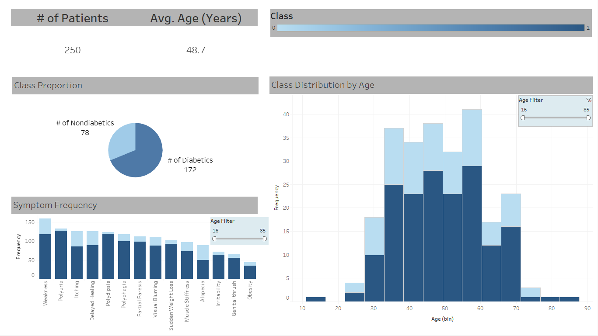

# Diabetes Detection and Visualization Pipeline

## Table of Contents
- [Dataset Overview](#dataset-overview)
- [Excel: Data Cleaning and Preprocessing](#excel-data-cleaning-and-preprocessing)
  - [1. Initial Setup](#1-initial-setup)
  - [2. Duplicate Removal](#2-duplicate-removal)
  - [3. Null Value Check](#3-null-value-check)
  - [4. Text Trimming](#4-text-trimming)
  - [5. Data Validation](#5-data-validation)
  - [6. Data Normalization](#6-data-normalization)
  - [7. Label Encoding](#7-label-encoding)
- [Further Processing in Python](#further-processing-in-python)
  - [1. Environment Setup](#1-environment-setup)
  - [2. Additional Data Processing](#2-additional-data-processing)
  - [3. Model Selection and Training](#3-model-selection-and-training)
- [Tableau Visualization](#tableau-visualization)
  - [1. Data Cleaning with Pandas](#1-data-cleaning-with-pandas)
  - [2. Exporting Data](#2-exporting-data)
- [Conclusion](#conclusion)

---

## Dataset Overview
The dataset, obtained from the [UCI Machine Learning Repository](https://archive.ics.uci.edu/dataset/529/early+stage+diabetes+risk+prediction+dataset), contains data for predicting the risk of early-stage diabetes.

### Data Summary
- **Total Entries**: 520 rows
- **Total Features**: 16 columns

---

## Excel: Data Cleaning and Preprocessing

### 1. Initial Setup
- Converted the dataset into a table format in Excel (`Table1`) for better organization and formatting.

### 2. Duplicate Removal
- Used the `Remove Duplicates` feature under `Data > Data Tools`.
- Removed 269 duplicate rows, leaving 251 unique entries.

### 3. Null Value Check
- Checked for null values using Excel functions:
  - `=COUNTIF(Table1[#Data], "NULL")`
  - `=COUNTIF(Table1, "")`
- No null values were found.

### 4. Text Trimming
- Applied the `TRIM()` function to remove excess whitespace.
- Converted text-formatted numbers (like 'Age') back to numeric using `=NUMBERVALUE()`.

### 5. Data Validation
- Ensured 'Age', 'Gender' (Male/Female), and binary Yes/No columns contained valid values using `Data > Data Validation`.

### 6. Data Normalization
- Normalized the 'Age' column using Min-Max normalization:
  ```excel
  =(Table1[@Age] - MIN(Table1[Age])) / (MAX(Table1[Age]) - MIN(Table1[Age]))

### 7. Label Encoding
- Encoded the target 'class' column (Positive/Negative) as binary values:
   ```=IF(Table1[@class] = "Positive", 1, 0)```

---

## Further Processing in Python
### 1. Environment Setup
- To recreate the environment, use Anaconda:
   ```
   conda create --name diabetes_prediction python=3.8
   conda activate diabetes_prediction
   conda install pandas numpy scikit-learn matplotlib seaborn
   ```
### 2. Additional Data Processing
- Read in Data: Cleaned data from Excel (`./data/diabetes_data_preprocessed.csv`) is read using Pandas.
- Outlier Detection: Boxplot revealed one outlier, which was removed using the Interquartile Range (IQR) method.
- One-Hot Encoding: Nominal features were one-hot encoded using `OneHotEncoder` from `sklearn`.
### 3. Model Selection and Training
- Defining Variables: Split data into independent (X) and dependent (Y) variables.
- Model Selection: Used `GridSearchCV` with a 50-50 train/test split and evaluated models using 10-fold cross-validation.
- Best Result: Support Vector Classifier (SVC) achieved 88% accuracy with a standard deviation of 0.0738.

---

## Tableau Visualization
### 1. Data Cleaning with Pandas
- Removed 269 duplicates, leaving 251 unique entries.
- Checked for missing entries (`.isna().any()`)—none were found.
- Detected and removed one outlier using IQR.
- Encoded binary labels using `LabelEncoder`.
### 2. Exporting Data
- Saved the cleaned data to CSV (`.to_csv()`), which is ready for Tableau visualization.
### 3. Visualization
- A simple, interactive dashboard was created in Tableau to visualize key patient demographics and basic descriptive statistics, providing insights into the distribution of potential diabetes risk factors across different groups. 


---
## Conclusion
- This project demonstrates the end-to-end process of data cleaning, preprocessing in both Excel and Python, model development, and visualization using Tableau.
- **Note to Employers**: This project illustrates how skills developed in bioinformatics, such as data cleaning, preprocessing, and analysis, can be effectively applied in broader data analytics and data science contexts.
